```mermaid
flowchart TB
    Goal[👤 GOAL<br/>Order Pizza]
    
    %% Gulf of Execution
    Plan[1. PLAN<br/>Decide what & when to order]
    Specify[2. SPECIFY<br/>Choose pizza type & toppings]
    Perform[3. PERFORM<br/>Tap confirm button]
    
    %% The World
    World[🌍 SYSTEM STATE<br/>Order processing...]
    
    %% Gulf of Evaluation
    Perceive[4. PERCEIVE<br/>See confirmation message]
    Interpret[5. INTERPRET<br/>Understand order accepted]
    Compare[6. COMPARE<br/>Match expectation with outcome]
    
    Goal -->|Gulf of Execution| Plan
    Plan --> Specify
    Specify --> Perform
    Perform --> World
    World -->|Gulf of Evaluation| Perceive
    Perceive --> Interpret
    Interpret --> Compare
    Compare -->|Success?| Goal
    
    style Goal fill:#e1f5ff,stroke:#01579b,stroke-width:3px
    style World fill:#fff3e0,stroke:#e65100,stroke-width:3px
    style Plan fill:#f3e5f5,stroke:#4a148c
    style Specify fill:#f3e5f5,stroke:#4a148c
    style Perform fill:#f3e5f5,stroke:#4a148c
    style Perceive fill:#e8f5e9,stroke:#1b5e20
    style Interpret fill:#e8f5e9,stroke:#1b5e20
    style Compare fill:#e8f5e9,stroke:#1b5e20
```

```mermaid
flowchart LR
    subgraph "Execution Side"
        G[Goal] --> P[Plan]
        P --> S[Specify]
        S --> Perf[Perform]
    end
    
    subgraph "Evaluation Side"
        Perc[Perceive] --> I[Interpret]
        I --> C[Compare]
        C --> G
    end
    
    Perf -.->|Feedback 1| Perc
    
    P -.->|Did I plan right?| Perc2[Micro-evaluation]
    S -.->|Is this correct?| Perc3[Micro-evaluation]
    Perf -.->|Did it work?| Perc4[Micro-evaluation]
    
    style Perc2 fill:#ffe0b2
    style Perc3 fill:#ffe0b2
    style Perc4 fill:#ffe0b2
    ```


    ```mermaid
flowchart TD
    Start([User Goal:<br/>Order Pizza]) --> Stage1[1. PLAN<br/>What do I want?]
    
    Stage1 --> Stage2[2. SPECIFY<br/>How do I do it?]
    Stage2 --> Pain1{Can I find<br/>the action?}
    Pain1 -->|No| Error1[❌ Gulf of Execution<br/>unclear UI]
    Pain1 -->|Yes| Stage3
    
    Stage3[3. PERFORM<br/>Execute action] --> System[System Response]
    
    System --> Stage4[4. PERCEIVE<br/>What happened?]
    Stage4 --> Pain2{Is feedback<br/>visible?}
    Pain2 -->|No| Error2[❌ Gulf of Evaluation<br/>no feedback]
    Pain2 -->|Yes| Stage5
    
    Stage5[5. INTERPRET<br/>What does it mean?] --> Pain3{Is it<br/>understandable?}
    Pain3 -->|No| Error3[❌ Poor feedback design]
    Pain3 -->|Yes| Stage6
    
    Stage6[6. COMPARE<br/>Did I succeed?] --> Success{Goal<br/>achieved?}
    Success -->|Yes| End([✅ Done])
    Success -->|No| Stage1
    
    Error1 --> Stage1
    Error2 --> Stage1
    Error3 --> Stage1
    
    style Start fill:#e3f2fd,stroke:#1976d2,stroke-width:3px
    style End fill:#c8e6c9,stroke:#388e3c,stroke-width:3px
    style Error1 fill:#ffcdd2,stroke:#c62828
    style Error2 fill:#ffcdd2,stroke:#c62828
    style Error3 fill:#ffcdd2,stroke:#c62828
    style System fill:#fff9c4,stroke:#f57f17,stroke-width:2px
    ```
    