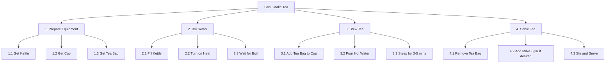
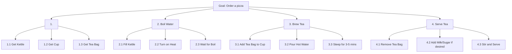

<!-- https://mermaid.js.org/syntax/gitgraph.html -->

### Ordering a pizza using a food delivery app

<!-- Online Food Ordering (e.g., e-food / Wolt) -->
<!-- Goal:

Order a pizza using a food delivery app. -->

 <!-- Example 2: Using an ATM -->
 <!-- Example 3: Check-in for a Flight (via kiosk or app) -->
 <!-- Goal:

Complete check-in and obtain boarding pass. -->

<!-- Example 4: Upload a Photo on Instagram -->
<!-- Goal:

Share a new post. -->