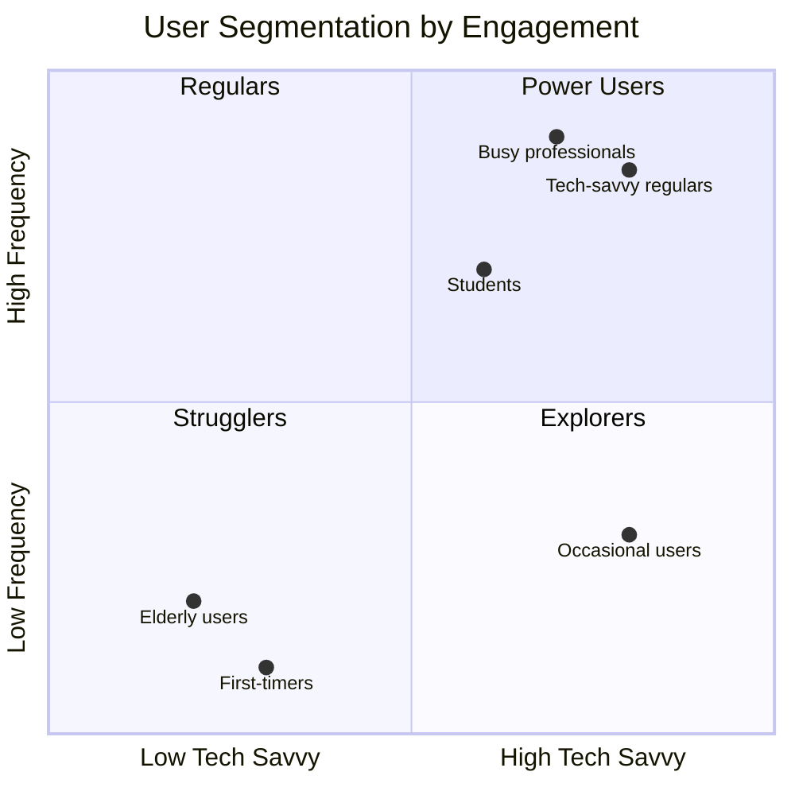

```mermaid
quadrantChart
    title User Segmentation by Engagement
    x-axis Low Tech Savvy --> High Tech Savvy
    y-axis Low Frequency --> High Frequency
    quadrant-1 Power Users
    quadrant-2 Regulars
    quadrant-3 Strugglers
    quadrant-4 Explorers
    "Tech-savvy regulars": [0.8, 0.85]
    "Busy professionals": [0.7, 0.9]
    "Students": [0.6, 0.7]
    "Occasional users": [0.8, 0.3]
    "Elderly users": [0.2, 0.2]
    "First-timers": [0.3, 0.1]
```